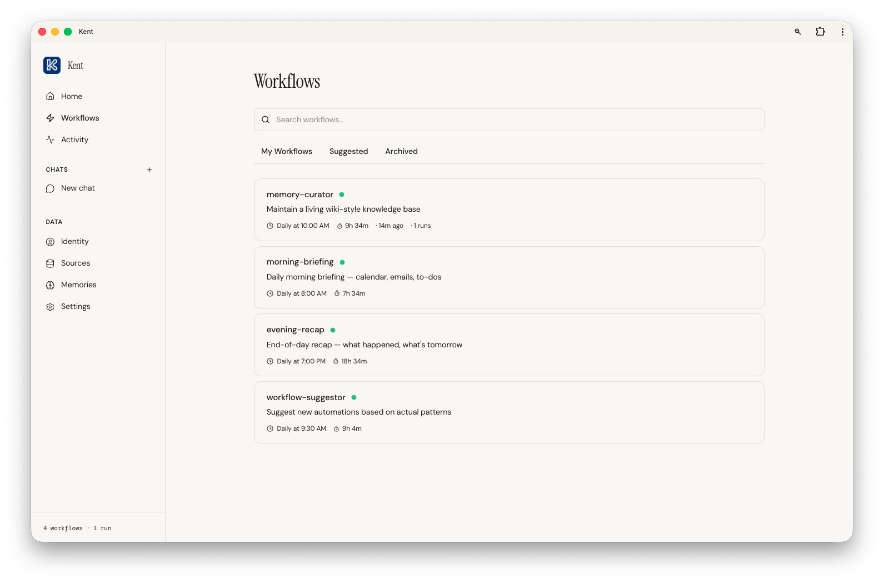

# Kent

Your personal AI agent that runs on your Mac. Kent syncs your data — iMessage, Gmail, GitHub, Chrome, Granola, Apple Notes — indexes it locally, and runs scheduled workflows powered by Claude.

Ask it what to focus on today. Get a daily brief of your meetings, emails, and PRs. Let it draft follow-ups from meetings. All your data stays on your machine.

## Install

Three ways to install Kent on macOS. Pick whichever you prefer — they all end up running the same code.

### 1. Desktop app (easiest)

Download the latest `.dmg` from the [releases page](https://github.com/andrewparkk1/kent-agent/releases), drag **Kent** into Applications, and launch it. The app bundles the daemon, web dashboard, and CLI — you don't need Bun or any other tools installed. The app walks you through setup on first launch.

### 2. npm (CLI-first)

```bash
# requires macOS and Bun (https://bun.sh)
bun install -g meet-kent
kent init
kent start
```

`kent init` walks you through connecting sources, adding your API keys, runs your first sync, starts the daemon, and opens the web dashboard.

### 3. Git clone (for development or local builds)

```bash
git clone https://github.com/andrewparkk1/kent-agent.git
cd kent-agent
bun install
bun run cli/index.ts init    # or: bun link && kent init
```

Run anything via `bun run cli/index.ts <command>`, or `bun link` once to expose `kent` on your `$PATH` pointing at your working tree. For the Tauri desktop app, `cd web && bun run tauri:build` produces a signed `.app` and `.dmg` in `web/src-tauri/target/release/bundle/`.

## Quick start

```bash
kent init                     # setup wizard — connect sources, add API keys
kent start                    # start all services (daemon + server)
```

After `kent start`, the daemon and server run as macOS system services. They'll stay running through sleep, reboot, and terminal closes. Check on them anytime:

```bash
kent status                   # check if everything is running
kent logs -f                  # stream daemon logs
kent stop                     # stop everything
```

## What it does

**Syncs your data** from local and cloud sources every few minutes. Everything is stored in a local SQLite database at `~/.kent/kent.db`.

**Answers questions with your context.** The agent has tools to search across all your synced data, so it can answer things like "what did Sarah say about the launch?" or "summarize my unread GitHub notifications."

**Runs workflows on a schedule.** Workflows are prompts that run on a cron schedule. Kent ships with defaults (morning briefing, evening recap, memory curator) and you can create your own from the CLI or web dashboard.

**Remembers things.** The agent maintains a persistent knowledge base — people, projects, preferences, events — that it references across conversations.

**Runs as a system service.** The daemon and web dashboard run as macOS launchd services that auto-restart on sleep, reboot, or crash. Once started, Kent is always on.

## Architecture

```
┌──────────────────────────────────────────┐
│  CLI / Web Dashboard                     │
├──────────────────────────────────────────┤
│  Daemon (launchd service)                │
│  ├─ Sync loop → sources every N min      │
│  ├─ Cron loop → run due workflows        │
│  └─ Backfill  → catch up missed runs     │
├──────────────────────────────────────────┤
│  Agent (subprocess per run)              │
│  ├─ LLM (Anthropic, OpenAI, Google, …)  │
│  └─ Tools: data, memory, workflow,       │
│     filesystem, skills                   │
├──────────────────────────────────────────┤
│  SQLite (~/.kent/kent.db)                │
│  items · threads · workflows · memories  │
└──────────────────────────────────────────┘
```

## Sources

Kent ships with 22 source adapters across six categories. Each is toggled individually from the Sources page in the dashboard.

**Apple (7)**

| Source | Notes |
|--------|-------|
| iMessage | Reads `chat.db`. Requires Full Disk Access. |
| Apple Notes | Reads `NoteStore.sqlite`. Requires Full Disk Access. |
| Apple Calendar | Reads local calendar store. Requires Full Disk Access. |
| Apple Reminders | Pulls reminders via AppleScript bridge. |
| Apple Health | Reads exported health data. |
| Apple Music | Library, playlists, recent listens. |
| Contacts | Reads the macOS address book. |

**Communication (5)**

| Source | Notes |
|--------|-------|
| Gmail | Via `gws` CLI. Also syncs Google Calendar and Google Tasks. |
| Outlook | Microsoft Graph API. OAuth required. |
| Slack | Messages and threads via Slack API. OAuth required. |
| WhatsApp | Reads `ChatStorage.sqlite` from WhatsApp Desktop. |
| Signal | Reads encrypted DB. Needs `brew install sqlcipher` and Signal Desktop. |

**Browsers (2)**

| Source | Notes |
|--------|-------|
| Chrome | History, bookmarks, downloads, search terms. |
| Safari | History and bookmarks. Requires Full Disk Access. |

**Notes & docs (4)**

| Source | Notes |
|--------|-------|
| Notion | Pages and databases via Notion API. Token required. |
| Granola | Meeting transcripts from local JSON files. |
| Obsidian | Indexes your vault's markdown files. |
| Recent Files | Recently opened files surfaced by macOS. |

**Dev (2)**

| Source | Notes |
|--------|-------|
| GitHub | Via `gh` CLI. Notifications, PRs, issues. |
| AI Coding | Claude Code and Codex conversation history from local session files. |

**Other (2)**

| Source | Notes |
|--------|-------|
| Spotify | Recent plays, playlists, top tracks. OAuth required. |
| Screen Time | Daily app/category usage from the local Screen Time DB. |

## Workflows



Workflows are prompts that run on a cron schedule. They live in the database and are managed via the CLI or web dashboard — no config files needed.

### Example workflows

We have a collection of [ready-to-use workflow prompts](examples/workflows/) you can copy and paste into Kent chat:

| Workflow | What it does |
|----------|-------------|
| [Meeting Prep](examples/workflows/meeting-prep.md) | Researches who you're meeting and creates private prep notes |
| [Calendar from Messages](examples/workflows/calendar-from-messages.md) | Scans messages for plans and deadlines, adds them to your calendar |
| [Weekly Goal Tracker](examples/workflows/weekly-goal-tracker.md) | Weekly check-in on your goals and what got in the way |
| [Daily Goal Tracker](examples/workflows/daily-goal-tracker.md) | End-of-day review of whether today moved you closer to your goals |
| [Dinner Planner](examples/workflows/dinner-planner.md) | Suggests a simple recipe every day based on your taste |
| [Daily Lesson](examples/workflows/daily-lesson.md) | Teaches you one concept a day on any topic, building over time |
| [Style Assistant](examples/workflows/style-assistant.md) | Learns your taste in clothes and suggests items weekly |

### Default workflows

| Workflow | Schedule | What it does |
|----------|----------|--------------|
| Morning briefing | 8am daily | Calendar, emails, to-dos, action items |
| Evening recap | 7pm daily | Today's summary, highlights, tomorrow preview |
| Memory curator | 10am daily | Reviews data, updates knowledge base, archives stale memories |
| Workflow suggestor | 9:30am daily | Analyzes patterns, suggests new automations |

### Managing workflows

```bash
kent workflow list                   # list all workflows
kent workflow create <name>          # create a new workflow
kent workflow run <name>             # manually trigger a workflow
kent workflow enable <name>          # enable a workflow
kent workflow disable <name>         # disable a workflow
kent workflow delete <name>          # delete a workflow
kent workflow history <name>         # show recent runs
```

You can also create, edit, enable/disable, and run workflows from the web dashboard.

## Web dashboard

Opens a local React dashboard at `http://localhost:19456` with pages for:

- **Home** — feed of recent workflow runs and briefs
- **Chat** — multi-turn conversations with the agent
- **Activity** — live stream of workflow runs with output previews
- **Workflows** — manage, enable/disable, run, view history
- **Sources** — sync status, item counts
- **Memories** — browse and search the knowledge base
- **Identity** — set your name, role, goals for better agent context
- **Settings** — configure sources, API keys, daemon interval

## CLI reference

```bash
kent                              # interactive REPL
kent init                         # setup wizard (first sync + daemon + web)
kent start                        # start all services (daemon + server)
kent stop                         # stop all services
kent status                       # check if all services are running
kent server start                 # start just the API server
kent server stop                  # stop just the API server
kent daemon start                 # start just the background sync worker
kent daemon stop                  # stop just the sync worker
kent daemon status                # live daemon status dashboard
kent logs [source] [-f]           # view logs (daemon|api|web)
kent sync                         # sync all sources now
kent sync --source imessage       # sync one source
kent sync --full                  # full re-sync (not incremental)
kent workflow list                # list workflows
kent workflow create <name>       # create a workflow
kent workflow run <name>          # manually run a workflow
kent workflow enable <name>       # enable a disabled workflow
kent workflow disable <name>      # disable a workflow
kent workflow delete <name>       # delete a workflow
kent workflow history <name>      # show recent runs for a workflow
kent --version                    # print version
kent --help                       # show help
```

## Development

```bash
bun run dev                       # start API server + Vite (hot reload)
bun run dev:api                   # start just the API server
bun run dev:web                   # start just Vite dev server
```

## Data and security

All data stays on your machine. Kent stores everything locally:

- `~/.kent/kent.db` — SQLite database (synced items, threads, workflows, memories)
- `~/.kent/config.json` — API keys, source toggles, daemon settings
- `~/.kent/daemon.log` — daemon activity log
- `~/.kent/prompts/` — agent system prompt files

**API keys and model providers:**

Kent supports multiple LLM providers. Configure your preferred provider during `kent init` or in `~/.kent/config.json`.

| Provider | Key required | Notes |
|----------|-------------|-------|
| Anthropic | Yes (default) | Claude models. Default: `claude-sonnet-4-6` |
| OpenAI | Optional | GPT models |
| Google | Optional | Gemini models |
| OpenRouter | Optional | Access multiple models via OpenRouter |
| Local (Ollama) | No | Local models via Ollama |
| Custom | Optional | Any OpenAI-compatible endpoint via `base_url` |

## Project structure

```
cli/          CLI entry point and commands
daemon/       Background sync daemon and source adapters
agent/        Agent subprocess, tools, prompts
shared/       Database, config, shared types
web/          React web dashboard (Vite + React)
tests/        Test suite
```

## License

MIT
